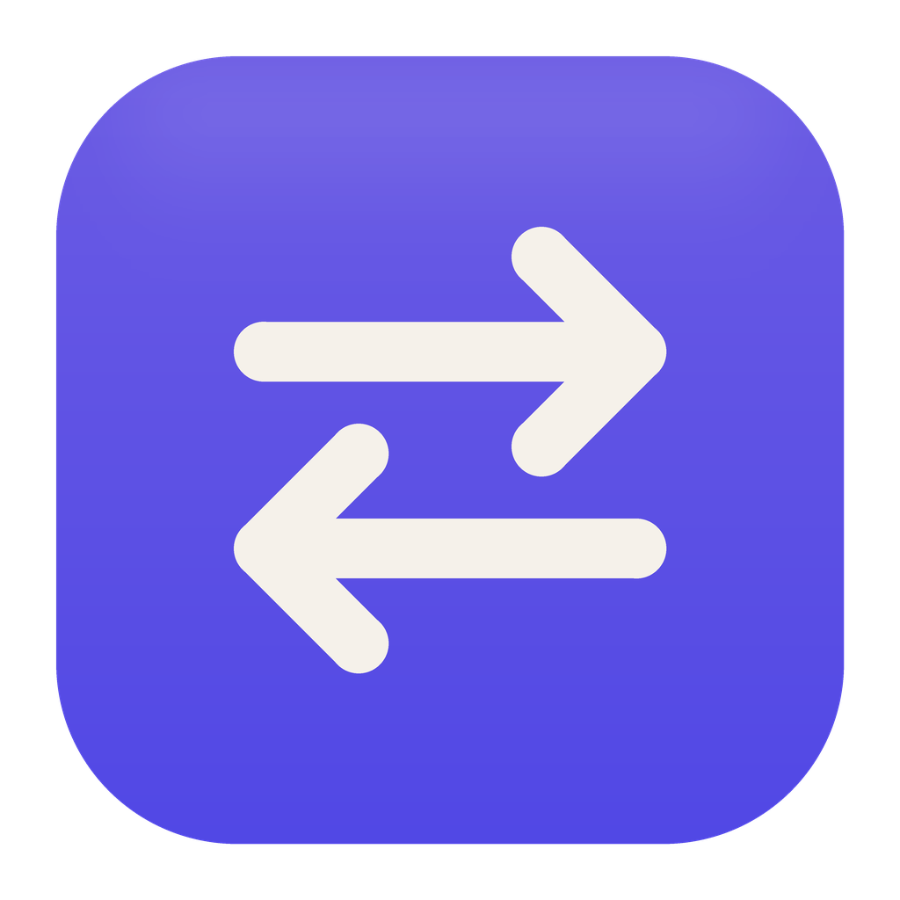
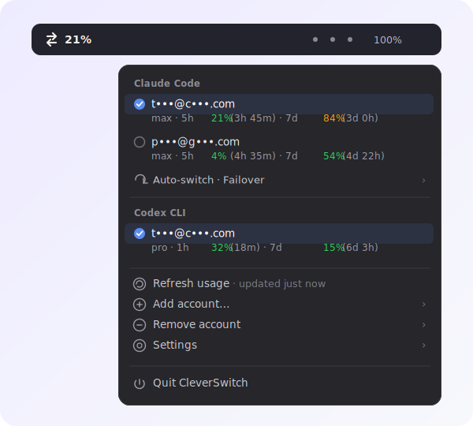

<!-- markdownlint-disable MD033 MD041 -->
<div align="center">



# CleverSwitch

### Juggle multiple AI coding accounts from your macOS menu bar.

One click to switch the active **Claude Code** or **Codex** session · live usage per account · auto-switch **before** you hit the limit.

[](https://github.com/Clevermation/cleverswitch/releases)
[](https://github.com/Clevermation/cleverswitch/actions)
[](LICENSE)
[](#requirements)
[](Package.swift)
[](#features)
[](https://clevermation.com)



</div>

## Install

```bash
brew install --cask clevermation/tap/cleverswitch
```

That's it — the app appears in your menu bar. Update later with `brew upgrade --cask cleverswitch`,
or remove it with `brew uninstall --cask cleverswitch`.

> No Apple Developer account, no notarization — CleverSwitch is ad-hoc signed and open source.
> The Homebrew cask clears the quarantine flag for you, so it just opens.

## Why

If you have more than one Claude Max or ChatGPT/Codex subscription, you keep hitting the
5-hour session wall mid-task and have to log into another account by hand. CleverSwitch keeps
all your logins ready, shows how close each one is to its limit, and can switch the active CLI
session **automatically before the wall** — so you never get interrupted.

## Features

- **🔀 One-click switch** between multiple Claude Code and Codex accounts — swaps the OAuth token the CLI reads, no re-login.
- **📊 Live usage** per account: each provider's session window + weekly window, in %, with a *resets-in* countdown. The menu bar shows the highest session usage across your active accounts at a glance.
- **🤖 Auto-switch**, three modes:

  | Mode | What it does |
  |---|---|
  | **Off** | Never switches automatically. |
  | **Failover** | Switches to a healthy account **just before** the limit (not at 100%, when it's already too late). |
  | **Balance** | Spreads usage evenly across accounts — runs on whichever has the most headroom, with hysteresis so it doesn't flap. |

- **🔑 Automatic token refresh** — expired tokens are renewed on the fly; switching never leaves you logged out.
- **🔒 Privacy-first** — credentials stay in the macOS Keychain / the CLI's own file; the account list holds no secrets. Hide email addresses in one click (great for screen recordings & streams): `you@company.com` → `y•••@c•••.com`.
- **🌍 16 languages**, automatically following your system language.
- **⚙️ Settings**: start at login · notifications · show/hide emails.

## How it works

Each CLI reads its credentials from exactly one place (Claude: a macOS Keychain entry, Codex:
`~/.codex/auth.json`). CleverSwitch keeps a copy of every account's token and, when you switch,
swaps the target account's token into that "live slot" — refreshing it first if needed. The
whole decision layer (when and where to auto-switch) is pure, provider-neutral, and unit-tested.

Adding an account runs the official `claude auth login` / `codex login` flow **headless** (no
terminal window pops up — the browser opens on its own), then imports the new account
automatically.

## Requirements

- **macOS 14 (Sonoma) or newer.** That's the only requirement to *run* the app — it's a small
  native Swift binary, no runtime to install, no Xcode.
- **Homebrew** to install via the command above.
- The **`claude` and/or `codex` CLI** installed for the accounts you want to manage. CleverSwitch
  drives their official login flows and reads their usage; it doesn't replace them. If a CLI
  isn't installed, its "Add account" simply tells you so.

## Troubleshooting

**"CleverSwitch can't be opened because Apple cannot check it for malware."**
The Homebrew cask clears the quarantine flag, so this normally won't appear. If you moved the app
manually, run once: `xattr -dr com.apple.quarantine /Applications/CleverSwitch.app`

**The menu shows no usage / "—".**
Make sure the `claude` and/or `codex` CLI is installed and you've logged in at least once via
*Add account*. Usage is read from each provider's official endpoint and may lag a few seconds
after a switch — use *Refresh usage*.

**Switching doesn't seem to take effect.**
A running CLI session reads its token once at start; restart it. New sessions pick up the
switched account immediately.

Logs live at `~/Library/Logs/CleverSwitch.log`.

## Privacy & security

CleverSwitch stores OAuth credentials only locally (macOS Keychain / `~/.codex/auth.json`) and
talks only to the official auth/usage endpoints of each provider. Nothing is sent anywhere else.
Please check your provider's terms regarding multi-account use.

## Build from source

Native Swift / SwiftUI (`MenuBarExtra`), built with the Swift Package Manager — no third-party
runtime dependencies.

```bash
swift build        # build
swift test         # run the test suite (CleverSwitchKit)
zsh packaging/assemble-app.sh   # assemble CleverSwitch.app
```

The logic lives in `CleverSwitchKit` (policy, store, OAuth, usage, providers) and is fully
testable without a GUI. Architecture & behaviour spec: [`docs/SPEC.md`](docs/SPEC.md).

## Contributing

Issues and PRs welcome. The behaviour is specified in [`docs/SPEC.md`](docs/SPEC.md); the policy
layer in `CleverSwitchKit` is pure and unit-tested, so logic changes come with tests.

## License

[MIT](LICENSE) — an independent, clean-room implementation. See [`NOTICE`](NOTICE).

<div align="center"><sub>🇩🇪 Made in Germany by <a href="https://clevermation.com"><b>Clevermation</b></a> — your AI-first agency.</sub></div>
